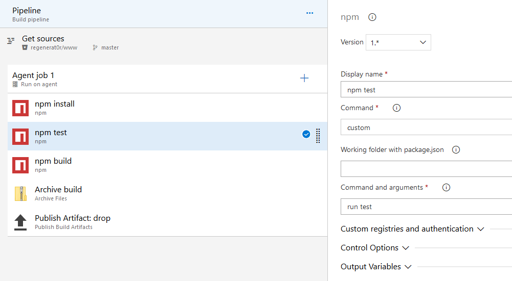
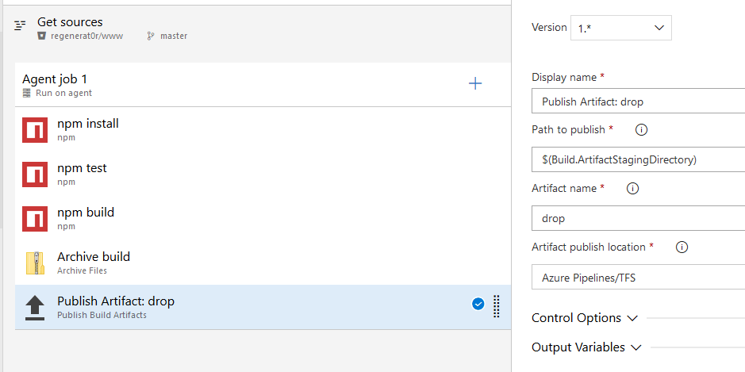

Back in August of this year Microsoft [announced static websites for azure blob storage](https://azure.microsoft.com/en-us/blog/azure-storage-static-web-hosting-public-preview/). So this is the same feature AWS' S3 has had for years. Essentially make a blob storage folder public, and redirect `/` paths to `/index.html` internally. Also, register 404 pages. Before we had this we use to deploy our files to `App Service` or do some weirdness with functions to rewrite urls. For static pages this can really bring costs down in the cloud

<!-- more -->

So the big idea is simple. Upload files into a blob container, serve pages, profit! This obviously becomes less simple when you have to do the devops. So recently I've been using Azure devops more. Basically, vsts rebranded! I've been into this service lately, mostly because of the dual windows and linux build machines you can get. My other favorite in this space is [circleci](https://circleci.com/). Since we're using azure, and Azure Devops has great intergration with azure. I took a crack and using it to push my react app to blob storage.

## Build

So an azure devops pipeline consists of 2 phases. Build, and release. To put this simply, build should generate our artifacts, and release should push them to production. Lets start with creating a simple react app with `npx create-react-app <appnamehere>`. This should generate a react app in the current directory. Pro tip, you can use `--typescript` if you want typescript support.

Ok, the build here should be very simple. We need to do the following steps

* clone our project
* install npm packages
* run the unit tests
* build the project
* archive the project files

To get started create a new build definition. Click get sources and configure your git repo. Next we need to do an npm install, this is pretty simple with the npm tasks in the gallery. Next we need to run `npm run test`. Pick the npm task, under command click custom and replace the command and arguments box with `run test`. Do the same after for the `build` phase. Add a step to zip the `build` directory, and finally add the publish artifact task with the path to your archive build file.

## Release

The release phase is pretty simple. We first need to extract our files from the build. Then publish to azure using this azure cli upload batch command `az storage blob upload-batch --source out/build --destination $container_name --account-key $AZURE_STORAGE_KEY --account-name $AZURE_STORAGE_ACCOUNT`. In my case I'm using linux, and bash is injecting those variables from the environment. You need to register your storage key and storage account name as secure variables to your account.

