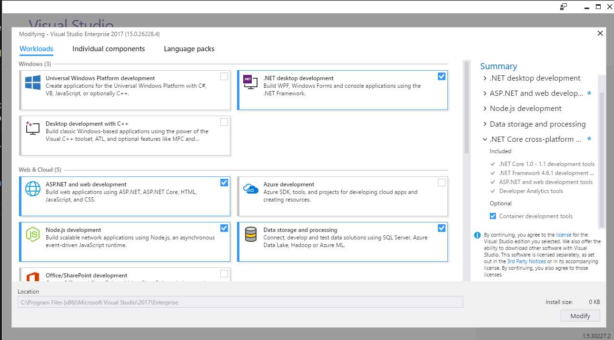

Today marks the release of Visual Studio 2017, and with it the final release of the tools for dotnet core. This means as of today you can build, test, and deploy an application completely supported by microsoft. Not just the runtimes, but the tooling as well. The CLI for dotnet core has been finalized, and its awesome. The csproj system has been revitalized. New csproj's can be created, and are fully compatible with the old. Visual studio 2017 has finally released. This is probably the greatest version of visual studio ever created. Finally VS has gone from a slow, archaic editor, to a fast moving IDE. An IDE with a DevOps-First Cloud-First mentality. An IDE ready to tackle today's modern challenges.

<!-- more -->

## Visual studio 2017

So I bet you are wondering, how is VS2017 improved. When you first boot the vs2017 installer you are immediately hit with a very sleek UI for the installer. The installer actually has reasonable install sizes for scenarios like nodejs only. 

VS2017 can understand which lines of code are linked to your unit tests. As you alter, or refactor code VS can run the tests. This can allow the editor to show checkmarks or red `x`'s This is huge as it can seemingly provide constant feedback to developers during development.

One of my huge annoyances with older versions of visual studio was the inability to edit csproj files. In the past to edit a csproj file you must "unload" the project, edit the file, and then reload the project. Traditionally this was a huge source of contention for me. I was unable to quickly edit my project files, and thus the build behavior. In the new version of visual studio, csproj files can be edited on the fly. No more mucking around loading, unloading, reloading projects. Just right click, edit, done.

## dotnet has a real CLI now!

One of my biggest gripes about dotnet for many years was the overall lack of CLI tools. Everything was hidden behind black box GUI's and weird COM calls. Installing nuget packages felt like a second class citizen, and was almost not do-able outside visual studio.

I have a more [extensive post on the subject](/Exploring-the-dotnet-cli/). I'd recomend you check it out. However here is a taste.

>Even during `project.json` days you could not just say install xyz package into my project. Instead you had to fumble around with files

In the dotnet core cli you can say `dotnet add package <RandomPackageHere>` and the package will promptly be installed into your project. No VS required, and no mucking about. This is the same as `npm install --save <RandomPackageHere>`. Want a new web project? `dotnet new web` simple.

## In closing

With these new announcements Microsoft is making a very bold push at once again being the top company for developers. They have listened to the feedback, they are rapidly evolving, and re-birthing themselves. Some have said over the last couple of years that they don't recognize this new Microsoft. I 100% agree with this sentiment. They have gone from having what appeared to be a legacy development system. To a modern cross platform technology stack. A stack that is rapidly being adopted by many developers. A stack that can truly be cloud native. Microsoft currently stands as the largest contributor to open source. Something just a few short years ago, they viewed as a bad idea. This astounding achievement did not come overnight, but has taken several years. However this new Microsoft will be a force to be reckoned with.